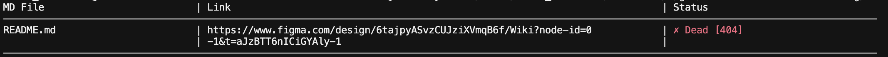

# Claude Session Report

## Initial Specification

### SPEC.md (Original Text)

```
implement cli utility using node.js with the following requirenments:
1) it receives the path to the folder
2) the main feature is to analyse all *.md file in the received folder
3) find all: links to the files (relative and absolute), links to the external resource http (https).
4) for each found link test the existance of the resource:
  - for absolute file links use folder root as a starting point
  - for relataive link check resure existance relatinve to the file where the link was found,
  - for to check http (https) link use HEAD request (support 3 retries, 5 sec timeout  for the retriable errors).
5) output result in a table with columns: md file name, found link, is link dead or not (use red for dead links and green for live)
Here some examples for the links:
 - [Dockerfile](https://github.com/larchanka-training/python-typescript-wiki/blob/main/proxy/Dockerfile)
 - [О проекте](01-Обзор%20проекта/О%20проекте.md)
 - [Sprint Demo](./Sprint%20Demo.md).
6) Ignore the following links:
 - anchor links to the same document ([Тестовые сценарии](#тестовые-сценарии))
 - image links like  [--only-dead]`

---

## Summary Statistics

| Metric           | Value                                                         |
| ---------------- | ------------------------------------------------------------- |
| Total Bugs Fixed | 4                                                             |
| User Prompts     | 4                                                             |
| Files Modified   | 2 (LinkChecker.js, TableFormatter.js)                         |
| Files Created    | 3 (index.js, LinkChecker.js, TableFormatter.js, package.json) |
| Git Commits      | 4                                                             |
| Features Added   | 1 (--only-dead flag)                                          |

---

## Git Commits History

1. **175458d** - implement md link checker cli utility
2. **efc55f1** - fix: handle encoded file links with anchors and add GET fallback for HEAD
3. **b82593c** - improve http link detection and table output formatting
4. **1e330f9** - fix head 405 fallback and add --only-dead flag

---

## Final Implementation Features

✅ Recursively scans all .md files in a directory  
✅ Extracts markdown links (relative and absolute paths, HTTP/HTTPS URLs)  
✅ Handles URL-encoded file paths with proper decoding  
✅ Ignores anchor-only links and image src attributes  
✅ Tests file existence relative to file location or folder root  
✅ Checks HTTP/HTTPS links with HEAD requests (3 retries, 5s timeout)  
✅ Falls back to GET request if HEAD returns 405  
✅ Displays results in 150-character formatted table  
✅ Color-coded status (green=live, red=dead) with HTTP response codes  
✅ Supports `--only-dead` flag to show only broken links

---

## CLI Output



## Cost report

Total cost: $1.01
Total duration (API) : 4m 55s
Total duration (wall): 20m 50s
Total code changes:
599 lines added, 86 lines removed
Usage by model: claude-haiku-4-5:
2.1k input, 20.8k output, 4.4m cache read, 367.6k cache write ($1.01)
